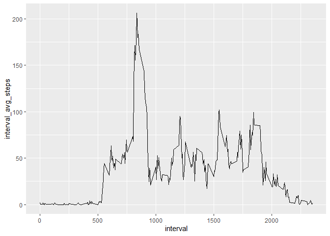

## Loading and preprocessing the data

```r
activity_data<-read.csv(unz("activity.zip", "activity.csv"), stringsAsFactors = FALSE)%>%
  mutate(date = ymd(date))
```

## What is mean total number of steps taken per day?

```r
day_counts<-filter(activity_data,complete.cases(activity_data))%>%
  group_by(date)%>%
  mutate(day_total = sum(steps))%>%
  select(date, day_total)%>%
  ungroup()%>%
  unique()
ggplot(day_counts,aes(x=day_total))+
  geom_histogram()
```

```
## `stat_bin()` using `bins = 30`. Pick better value with `binwidth`.
```

<!-- -->

```r
day_mean_steps = round(mean(day_counts$day_total),1)
day_median_steps = median(day_counts$day_total)
```

The daily mean is 10766.2 and the daily median is 10765.


## What is the average daily activity pattern?

```r
interval_avgs<-filter(activity_data,complete.cases(activity_data))%>%
  group_by(interval)%>%
  mutate(interval_avg_steps = mean(steps))%>%
  select(interval, interval_avg_steps)%>%
  ungroup()%>%
  unique()
ggplot(interval_avgs,aes(x=interval, y=interval_avg_steps))+
  geom_line()
```

<!-- -->

```r
max_steps_interval = interval_avgs$interval[interval_avgs$interval_avg_steps
                                            == max(interval_avgs$interval_avg_steps)]
```
The interval with the largest average number of steps is 835.

## Inputing missing values
There are 15264 rows with missing data in the raw data, these will be filled in using the average calculated for the intervals calculated previously.


```r
filled_data<-mutate(activity_data, 
                    steps = ifelse(is.na(steps), 
                                   filter(interval_avgs, 
                                          interval_avgs$interval == interval)$interval_avg_steps,
                                  steps))

filled_data_day_totals<-group_by(filled_data, date)%>%
  mutate(day_total = sum(steps))%>%
  select(date, day_total)%>%
  ungroup()%>%
  unique()

ggplot(filled_data_day_totals,aes(x=day_total))+
  geom_histogram()
```

```
## `stat_bin()` using `bins = 30`. Pick better value with `binwidth`.
```

<!-- -->

```r
filled_day_mean_steps = round(mean(filled_data_day_totals$day_total),1)
filled_day_median_steps = median(filled_data_day_totals$day_total)
```

With the missing values filled, the new daily mean  is 10766.2 and the new daily median is 10765. This is a change of 0 for the daily mean and 0 for the median.

## Are there differences in activity patterns between weekdays and weekends?

```r
filled_interval_avgs<-mutate(filled_data, day_type 
                             = as.factor(ifelse(weekdays(date) %in% c('Saturday', 'Sunday'),
                                                'Weekend', 'Weekday')))%>%
  group_by(interval, day_type)%>%
  mutate(avg_steps = mean(steps))%>%
  select(day_type,interval, avg_steps)%>%
  ungroup()%>%
  unique()
ggplot(filled_interval_avgs,aes(x=interval, y=avg_steps))+
  geom_line()+
  facet_grid(day_type ~ .)
```

<!-- -->
Yes, the steps tend to start later on weekends as people sleep in.

